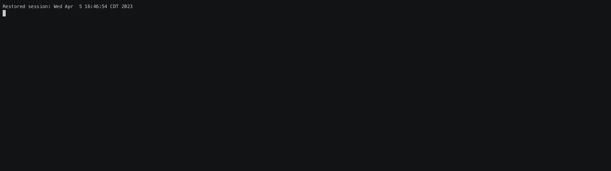
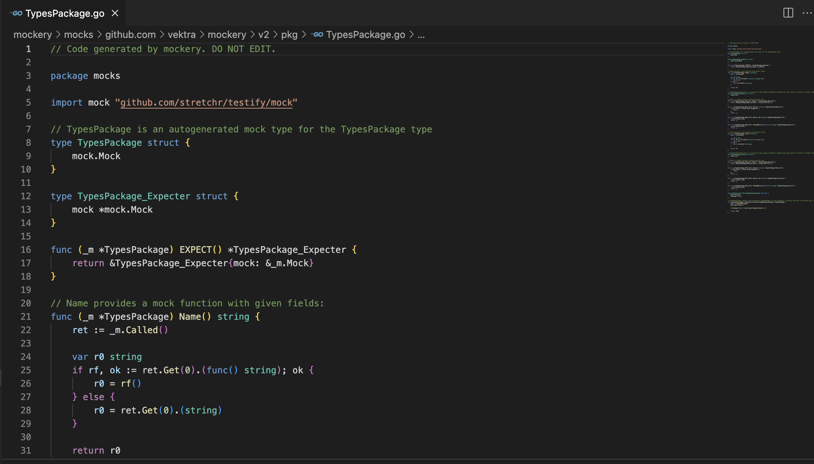
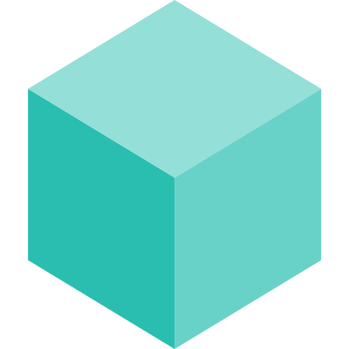

mockery
========

Mockery is a project that creates mock implementations of Golang interfaces. The mocks generated in this project are based off of the [github.com/stretchr/testify](https://github.com/stretchr/testify) suite of testing packages.




Why mockery?
-------------

When you have an interface like this:

```golang title="db.go"
type DB interface {
	Get(val string) string
}
```

and a function that takes this interface:

```golang title="db_getter.go"
func getFromDB(db DB) string {
	return db.Get("ice cream")
}
```

We can use simple configuration to generate a mock implementation for the interface:

```yaml title=".mockery.yaml"
with-expecter: True
packages:
	github.com/org/repo:
		interfaces:
			DB:
```

<div class="result">
```bash
$ mockery
05 Mar 23 21:49 CST INF Starting mockery dry-run=false version=v2.20.0
05 Mar 23 21:49 CST INF Using config: .mockery.yaml dry-run=false version=v2.20.0
05 Mar 23 21:49 CST INF Walking dry-run=false version=v2.20.0
05 Mar 23 21:49 CST INF Generating mock dry-run=false interface=DB qualified-name=github.com/org/repo version=v2.20.0
```
</div>

We can then use the mock object in a test:

```go title="db_getter_test.go"
import (
	"testing"

	"github.com/stretchr/testify/assert"
)

func Test_getFromDB(t *testing.T) {
	mockDB := NewMockDB(t)
	mockDB.EXPECT().Get("ice cream").Return("chocolate").Once()
	flavor := getFromDB(mockDB)
	assert.Equal(t, "chocolate", flavor)
}
```

Why use mockery over gomock?
-----------------------------

1. mockery provides a much more user-friendly API and is less confusing to use
2. mockery utilizes `testify` which is a robust and highly feature-rich testing framework
3. mockery has rich configuration options that allow fine-grained control over how your mocks are generated
4. mockery's CLI is more robust, user-friendly, and provides many more options
5. mockery supports generics (this may no longer be an advantage if/when gomock supports generics)

Who uses mockery?
------------------

<div class="grid cards" markdown>
- <figure markdown>
	[{ class="center" width="100" }](https://github.com/kubernetes/kubernetes)
	<figcaption>[Kubernetes](https://github.com/search?q=repo%3Akubernetes%2Fkubernetes%20mockery&type=code)</figcaption>
  </figure>
- <figure markdown>
	[{ class="center" width="100" }](https://github.com/grafana/grafana)
	<figcaption>[Grafana](https://github.com/grafana/grafana)</figcaption>
  </figure>
- <figure markdown>
	[{ class="center" width="100" }](https://github.com/google/skia)
	<figcaption>[Google Skia](https://github.com/google/skia)</figcaption>
  </figure>
- <figure markdown>
	[{ class="center" width="100" }](https://github.com/google/syzkaller)
	<figcaption>[Google Skyzkaller](https://github.com/google/syzkaller)</figcaption>
  </figure>
- <figure markdown>
	[{ class="center" width="100" }](https://github.com/search?q=org%3Ahashicorp%20mockery&type=code)
	<figcaption>[Hashicorp](https://github.com/search?q=org%3Ahashicorp%20mockery&type=code)</figcaption>
  </figure>
- <figure markdown>
	[{ class="center" width="100" }](https://github.com/uber/cadence)
	<figcaption>[Uber Cadence](https://github.com/uber/cadence)</figcaption>
  </figure>
- <figure markdown>
	[{ class="center" width="300" }](https://github.com/jaegertracing/jaeger)
	<figcaption>[Jaegertracing](https://github.com/jaegertracing/jaeger)</figcaption>
  </figure>
- <figure markdown>
	[{ class="center" width="300" }](https://github.com/splunk/kafka-mq-go)
	<figcaption>[Splunk kafka-mq-go](https://github.com/splunk/kafka-mq-go)</figcaption>
  </figure>
- <figure markdown>
	[{ class="center" width="300" }](https://github.com/ignite/cli)
  </figure>
- <figure markdown>
	[{ class="center" width="300" }](https://github.com/tendermint/tendermint)
  </figure>
- <figure markdown>
	[{ class="center" width="300" }](https://github.com/DataDog/datadog-agent)
  </figure>
- [](https://seatgeek.com)
- <figure markdown>
    [{ class="center" width="300" }](https://github.com/eksctl-io/eksctl)
	<figcaption>[eksctl](https://github.com/eksctl-io/eksctl)</figcaption>
  </figure>
- <figure markdown>
    [{ class="center" width="300" }](https://github.com/search?q=org%3Amongodb%20mockery&type=code)
  </figure>
- <figure markdown>
	[{ class="center" width="300" }](https://taskfile.dev/)
	<figcaption>[Task](https://taskfile.dev/)
  </markdown>
  - <figure markdown>
	[{ class="center" width="300" }](https://github.com/cerbos/cerbos)
  </markdown>
</div>


[Get Started](installation.md){ .md-button .md-button--primary .md-button--stretch }
